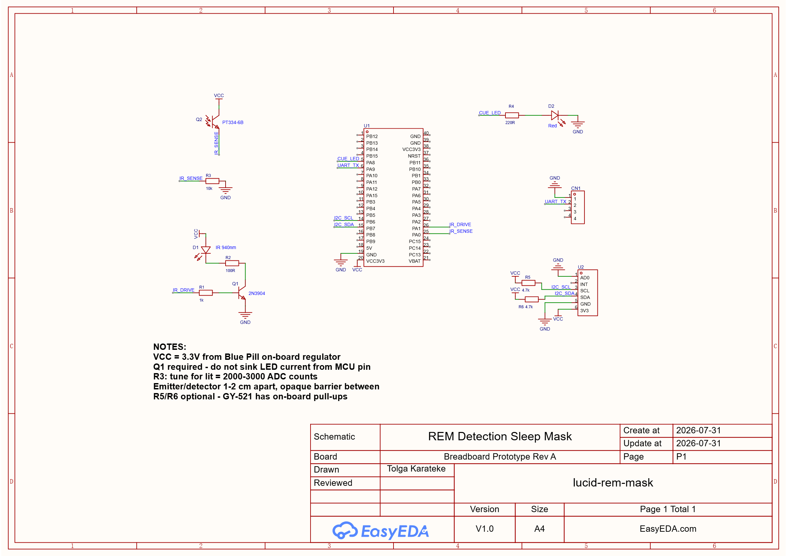

# Lucid REM Mask

A sleep mask that tries to detect REM sleep by watching eyelid movement, and
then flashes a red LED in a pattern. The idea is that you notice the flashing
inside your dream and realise you're dreaming (lucid dreaming).

STM32F103C8T6 (Blue Pill), STM32Cube HAL, built with `arm-none-eabi-gcc`.

**Current status:** firmware is written and tested on a PC, schematic is done.
I haven't built the hardware yet, so the detection thresholds are still based
on simulated signals rather than real recordings. See
[What's not done](#whats-not-done).

## How it works

An IR LED shines on the closed eyelid and a phototransistor measures how much
light comes back. When the eye moves under the lid, the cornea pushes the lid
around a bit and the reflection changes. REM sleep has bursts of rapid eye
movements, so if you count those movements over a 30 second window you get a
rough idea of whether someone is in REM.

The tricky part isn't detecting movement, it's ignoring everything else. Room
lights, rolling over, the mask sliding, the room warming up. All of those
produce much bigger signals than an actual eye movement, so most of the code is
about rejecting them.

```
IR LED on  -> read ADC  \
                         > reflect = lit - dark   (cancels room light)
IR LED off -> read ADC  /
                              |
                     slow average (baseline)
                              |
                  band-pass filter 0.16-2.5 Hz
                              |
              threshold = 3.5 x measured noise level
                              |
                    count movements per 30 s
                              |
              2 of last 3 windows look like REM -> REM
                              |
                   red LED: .. .. --- --- .. ..
```

The accelerometer runs alongside this and tells the detector when to throw
samples away.

## Some things I had to figure out

**Room light swamps everything.** A phone screen turning on changes the reading
by about 800 counts. An eye movement changes it by about 50. So instead of one
reading I take two, one with the IR LED on and one with it off, and subtract
them. Whatever light is in both readings cancels out. The two readings are
250 microseconds apart so nothing else has time to change. This is the same
thing an IR remote receiver does, just in software.

**Fixed thresholds don't work.** I first tried "if the signal jumps more than X
counts, count it as an eye movement". That breaks as soon as you change the
mask tension or the person wearing it. Now the code measures the noise level
continuously and puts the threshold at 3.5 times whatever the noise currently
is.

**Subtracting a slow average wasn't enough.** My first version was just
`signal - slow_average`. When I ran the test on the PC I found this leaves
about 40% of slow drift behind, which pushed the measured noise up to 13 counts
and the threshold to about 50. So the detector went deaf whenever the room
temperature drifted. Subtracting a second, slower average fixed it: noise
dropped to 1.3 counts and the same test found 72 movements instead of 48, still
with no false positives. I only found this because the algorithm compiles on a
PC. Would have taken weeks to notice on hardware.

**Movement and mask slipping are different problems.** If you just move, the
samples are noisy and I skip them. But if you roll over or the mask shifts, the
whole DC level changes and the stored baseline is now wrong. In that case the
baseline filter switches to a fast mode so it catches up in about 0.3 s instead
of 13 s.

**Interrupt does almost nothing.** TIM2 fires at 50 Hz and just sets a flag. All
the I2C and ADC work happens in the main loop. If a sensor hangs, the sample
rate drops instead of the whole thing locking up.

## Hardware

| Signal | Pin | Note |
|---|---|---|
| Phototransistor | `PA0` (ADC1_IN0) | emitter follower, 10k to GND |
| IR LED drive | `PA1` | through an NPN, don't drive the LED from the pin |
| Red cue LED | `PA8` (TIM1_CH1) | PWM so brightness is adjustable |
| Status LED | `PC13` | the one already on the Blue Pill, active low |
| MPU6050 SCL | `PB6` | |
| MPU6050 SDA | `PB7` | |
| Telemetry TX | `PA9` | 115200 8N1 |

Parts:

| Ref | Part | Value |
|---|---|---|
| U1 | Blue Pill (STM32F103C8T6) | |
| U2 | MPU6050 / GY-521 | |
| Q1 | NPN transistor | 2N3904 |
| Q2 | Phototransistor | PT334-6B |
| D1 | IR LED | 940 nm |
| D2 | Red LED | 5 mm |
| R1 | Q1 base | 1k |
| R2 | IR LED current limit | 100R (about 20 mA) |
| R3 | Phototransistor load | 10k |
| R4 | Cue LED current limit | 220R |
| R5, R6 | I2C pull-ups | 4.7k (optional, the GY-521 has its own) |

Clock is HSE 8 MHz with PLL x9 for 72 MHz. APB1 divided by 2 because it can't
go above 36 MHz. ADC prescaler is 6, not 4, because the ADC clock has a 14 MHz
limit and going over it doesn't throw an error, it just gives you wrong
readings.

R3 is the one you actually have to tune. If the `lit` value in the telemetry is
near 4095 the front end is saturated and you won't see anything. Aim for
somewhere around 2000-3000.

Put the IR LED and the phototransistor 1-2 cm apart, both pointing at the same
spot on the eyelid, with something opaque between them so light only reaches
the detector after bouncing off the lid.

## Schematic



Drawn in EasyEDA. DRC passes with 0 errors. The warnings it gives are all
unconnected pins, which is expected since I only use 9 of the 40 pins on the
Blue Pill header.

[PDF version](hardware/schematic.pdf)

Q1 is there so the IR LED current comes from the 3V3 rail instead of the MCU
pin. The phototransistor is an emitter follower, so more light means a higher
ADC reading. AD0 is tied to ground which puts the MPU6050 at address 0x68. I
used net labels instead of drawing long wires because the module's pins are
split across both sides of its symbol.

No PCB yet, this is meant for a breadboard.

## Code

| File | What it does | Lines |
|---|---|---|
| `app.c` | sampling loop, state machine, telemetry | 200 |
| `rem_detect.c` | filtering and REM scoring, no HAL so it runs on a PC | 123 |
| `led_cue.c` | the flash pattern, non-blocking | 106 |
| `motion.c` | deciding when to ignore samples | 78 |
| `mpu6050.c` | accelerometer driver | 73 |
| `ir_sensor.c` | IR reading with ambient rejection | 58 |
| `config.h` | every number you might want to change | 41 |

`main.c` comes from CubeMX, I don't edit it apart from three calls:

```c
/* USER CODE BEGIN 2 */
HAL_ADCEx_Calibration_Start(&hadc1);
App_Init(&hadc1, &hi2c1, &htim1, TIM_CHANNEL_1, &htim2, &huart1);
/* USER CODE END 2 */

while (1) { /* USER CODE BEGIN 3 */ App_Tick(); }

/* USER CODE BEGIN 4 */
void HAL_TIM_PeriodElapsedCallback(TIM_HandleTypeDef *htim)
{
  if (htim->Instance == TIM2) { App_OnSampleTimer(); }
}
/* USER CODE END 4 */
```

Keeping everything in `app.c` means regenerating the CubeMX project doesn't
delete my code.

## Behaviour

```
BOOT -> CALIBRATE -> WAIT_SLEEP -> MONITOR -> CUE -> REFRACTORY
         15 s        10 min still    REM?    23 s     15 min
                                       ^                |
                                       +----------------+
```

It also won't flash anything until 90 minutes after you fall asleep, since the
first REM period basically never happens before that. Anything detected earlier
is almost certainly a false alarm. I'd rather miss a REM period than wake
someone up for nothing.

The status LED on PC13 blinks differently in each state so you can tell what
it's doing without a serial cable:

| State | LED |
|---|---|
| CALIBRATE | fast blinking |
| WAIT_SLEEP | short blink every 2 s |
| MONITOR | quick blip every 4 s |
| CUE | off, so it doesn't get confused with the actual cue |
| REFRACTORY | longer blink every 4 s |

The cue pattern is two short flashes, two long, two short, repeated 3 times
(23.4 seconds total). Brightness defaults to 30% PWM. This is probably the
parameter that matters most: too dim and you won't notice it in the dream, too
bright and you just wake up.

## Building

```bash
make -j4
STM32_Programmer_CLI -c port=SWD -w build/lucid-rem-mask.bin 0x08000000 -rst
```

Peripheral setup is done in CubeMX with the Makefile toolchain option. If you
regenerate, remember to add my `.c` files back to `C_SOURCES` in the Makefile.

## Telemetry

With `TELEMETRY_ENABLE` set to 1 it sends CSV over USART1 at 115200:

```
t_ms,state,lit,dark,reflect,baseline,ac,thr,ev_win,ev_tot,mag_mg,dev_mg,quiet_s,motion,rem
```

Everything is sent as integers because printing floats needs newlib's float
support, which costs a few kB of flash and an extra linker flag. Values that
need decimals are scaled first, so `mag_mg` is in milli-g rather than g.

Once I have real recordings I'll write something to plot these.

## Testing

`rem_detect.c` doesn't touch the HAL, so it compiles and runs on a PC:

```bash
cd tools && make test
```

The test generates a fake 10 minute night (quiet, then REM with eye movement
bursts, then a movement artefact, then quiet again) and checks that REM gets
detected in the right part and not in the others.

```
phase A (quiet NREM, 180 s) :   0 events, REM flagged = no
phase B (REM, 180 s)        :  72 events, REM flagged = YES
phase C (movement, 60 s)    :   0 events (should be 0)
phase D (quiet NREM, 180 s) :   1 events, REM flag at end = no

RESULT: PASS
```

## Tuning

Everything adjustable is in `Core/Inc/config.h`.

| Problem | Try |
|---|---|
| No events during REM | lower `EVENT_K`, or `EVENT_THRESH_MIN` |
| Events while awake and lying still | raise `EVENT_K`, check the front end isn't saturated |
| REM detected while moving | raise `MOTION_HOLD_MS` |
| `lit` stuck near 4095 | smaller resistor for R3 |
| `reflect` near zero | IR LED current too low, or sensors not aimed right |
| Cue wakes you up | lower `CUE_BRIGHTNESS_PCT` |

For testing on the bench, drop `SLEEP_LATENCY_MS` and `SLEEP_ONSET_QUIET_MS`
to a few seconds, otherwise nothing happens for 90 minutes.

## What's not done

- I haven't built the circuit yet, so none of this has run on real hardware.
- The thresholds come from simulated signals. They're reasonable starting
  points but they'll need adjusting once I have real recordings.
- No PCB.
- No power saving. It should sleep between samples so it can run all night on
  a small battery.
- No logging to flash, so right now you need a serial cable connected to see
  anything.

Things I want to add later:

- A pulse sensor (MAX30102). Heart rate variability goes up in REM, so it would
  give a second independent signal instead of relying only on the IR reading.
- A single channel EOG front end. That measures eye movement electrically
  instead of optically and is what sleep labs actually use.

## Limitations

Measuring light bounced off the eyelid is an indirect way of detecting eye
movement, and without EEG there's no way to actually confirm sleep stage. Sleep
onset is guessed from the person not moving for 10 minutes, which is the best
I can do with an accelerometer.

This is a university project, not a medical device. Don't use it for anything
that matters.

## License

MIT